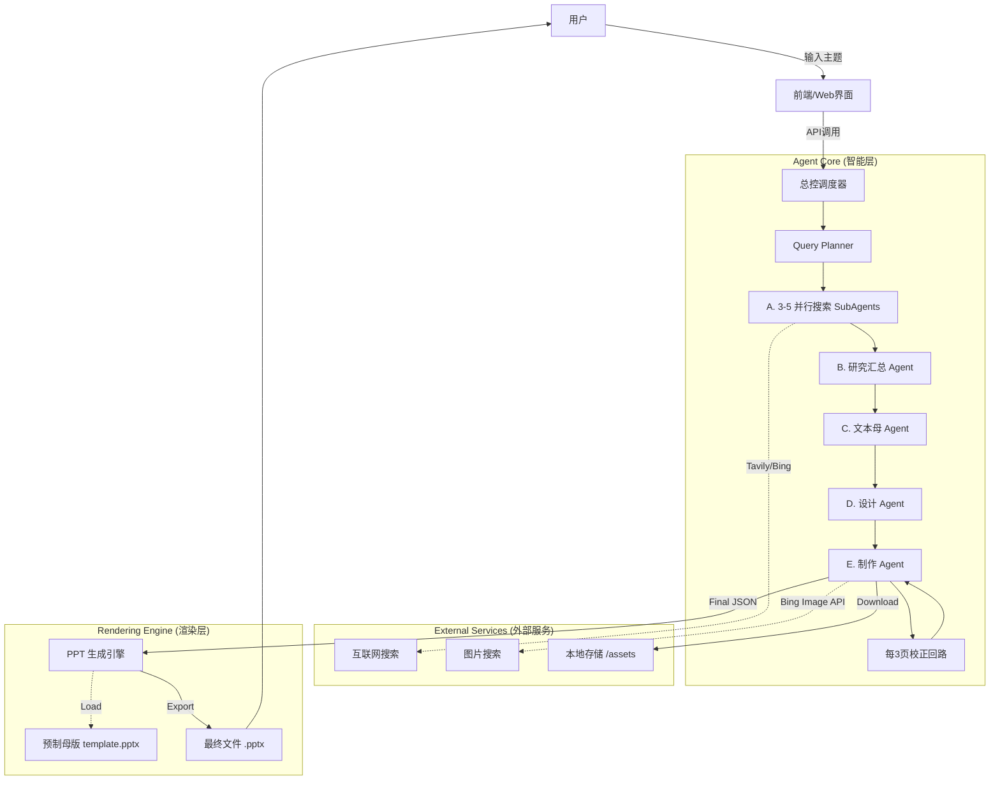

> 文档版本：v1.0  
> 负责人：Manus AI  
> 最后更新：2026-02-06  
> 状态：draft

# 3. 系统架构

AutoPPT Agent 的系统架构设计旨在实现高度的自动化、模块化和可扩展性。我们采用 **"线性流水线 (Linear Pipeline)"** 结合 **"中间层数据驱动 (Data-Driven)"** 的核心模式，确保从用户意图到最终演示文稿的转化过程清晰、可控且高效。

## 3.1 顶层架构图

整个系统由三个核心部分组成：**智能层 (Agent Core)**、**渲染层 (Rendering Engine)** 和 **外部服务 (External Services)**。这三者通过一个**总控调度器 (Orchestrator)** 进行协调，并由一个 **Web 界面 (WebUI)** 与用户交互。



## 3.2 八阶段流水线 (The 8-Stage Pipeline)

系统的工作流程被划分为一个严格的、线性的八阶段流水线。每个阶段都有明确的输入、处理过程、输出和质量门禁（Gatekeeping），确保只有在当前阶段通过校验后，任务才会进入下一阶段。这种设计保证了每一步的质量和整个流程的稳定性。

| 阶段 | 名称 | 核心任务 | 输出产物 |
|---|---|---|---|
| **Stage 0** | 意图解析 (Intent Intake) | 规范化用户输入，提取核心主题和约束。 | `task_profile` |
| **Stage 1** | 检索规划 (Query Planning) | 生成多个互补的搜索查询维度。 | `query_plan` |
| **Stage 2** | 并行搜索 (Parallel Search) | 分配多个子Agent并行执行搜索，收集证据。 | `evidence_bundle` |
| **Stage 3** | 汇总与归档 (Synthesis & Archival) | 对搜索结果去重、整合，并生成研究摘要。 | `research_package` |
| **Stage 4** | 页面规划 (Page Planning) | 结合研究摘要和用户期望，决定PPT的页数和每一页的核心内容。 | `Draft JSON` |
| **Stage 5** | 素材填充 (Asset Enrichment) | 根据页面规划，搜索、下载并预处理所需的图片素材。 | `Final JSON` |
| **Stage 6** | 制作与页级校验 (Build & Page Validation) | 逐页将结构化数据渲染成PPT页面，并进行即时校验。 | `draft_slides.json` |
| **Stage 7** | 批量校正与导出 (Batch Cross-Check & Export) | 每隔几页进行一次跨页一致性校正，最终导出完整的 `.pptx` 文件。 | `output.pptx` |

这种分阶段的设计不仅使得复杂任务得以拆解，也为每个环节的监控、调试和优化提供了清晰的框架。更详细的流水线设计请参阅 **[02_architecture/02_pipeline_design.md](./../02_architecture/02_pipeline_design.md)**。

## 3.3 目录结构

为了保证代码的整洁性、可维护性和模块化，项目遵循统一的目录结构规范。这有助于开发者快速定位代码、理解模块职责，并确保任务产物的有序归档。

```bash
AutoPPT-Agent/
├── assets/                  # 存放下载的临时图片资源
├── templates/               # 存放 PPT 母版文件
├── src/
│   ├── agents/              # 各类 Agent 的核心逻辑
│   ├── engine/              # PPT 渲染引擎
│   ├── schemas/             # Pydantic 数据模型定义
│   └── utils/               # 通用工具类
├── runs/                    # 每个任务的运行时产物归档
├── app.py                   # 主程序入口 (FastAPI 或 Streamlit)
├── requirements.txt         # Python 依赖包
└── README.md
```

该结构将核心业务逻辑（`src`）、运行时数据（`runs`）、静态资源（`assets`, `templates`）清晰地分离开来，是现代软件工程的最佳实践。
