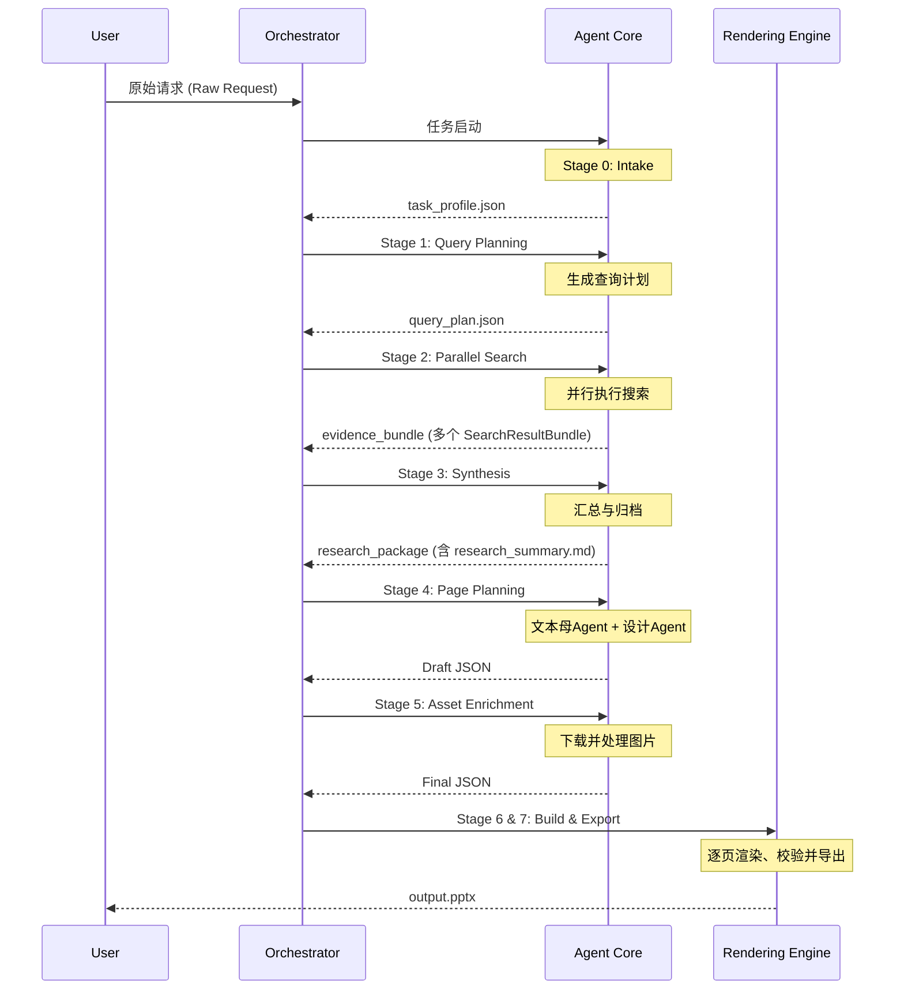

> 文档版本：v1.0  
> 负责人：Manus AI  
> 最后更新：2026-02-06  
> 状态：draft

# 3. 数据流设计

AutoPPT Agent 的数据流设计是其模块化和灵活性的关键。系统不依赖于复杂的类继承或紧密的函数调用，而是通过一系列标准化的、可序列化的中间数据结构（主要为 JSON）来驱动整个流程。这确保了各阶段之间的清晰解耦。

## 3.1 数据流核心原则

- **不可变性（Immutability）**: 每个阶段接收上一个阶段的输出作为输入，但它不应修改输入数据。相反，它会创建一个新的数据结构作为其输出。这使得数据流易于跟踪和调试。
- **协议优先（Protocol-First）**: 所有中间数据结构的格式都在 **[数据协议规范](../03_specifications/01_data_protocol/)** 中被严格定义。任何模块的开发都必须首先遵循这些协议。
- **可序列化（Serializable）**: 所有在阶段间传递的数据都必须是可JSON序列化的。这不仅使得数据易于存储、传输和检查，也为未来将不同阶段作为独立的微服务部署提供了可能性。

## 3.2 数据流图

下图展示了核心数据对象如何在八阶段流水线中流转和演变。

## 3.3 关键数据对象

| 数据对象 | 生成阶段 | 消费阶段 | 描述 |
| :--- | :--- | :--- | :--- |
| `task_profile.json` | Stage 0 | Stage 1 | 包含任务的核心主题、约束和用户偏好。 |
| `query_plan.json` | Stage 1 | Stage 2 | 定义了需要并行执行的搜索查询列表。 |
| `SearchResultBundle` | Stage 2 | Stage 3 | 单个搜索子任务的输出，包含查询元数据和一系列搜索结果。 |
| `research_summary.md` | Stage 3 | Stage 4 | 经过整合、去重和分析后的研究摘要，是内容生成的主要依据。 |
| `Draft JSON` | Stage 4 | Stage 5 | 初步的PPT页面描述，包含文本内容和布局信息，但图片路径是待填充的搜索查询。 |
| `Final JSON` | Stage 5 | Stage 6 | 最终的、可供渲染的数据包，包含所有文本内容和指向本地的、已处理好的图片路径。 |
| `output.pptx` | Stage 7 | 用户 | 最终交付给用户的、可编辑的PowerPoint文件。 |

这种以数据为中心的流动方式，使得每个阶段都可以被视为一个纯函数：接收一个标准化的输入，并产生一个标准化的输出。这种设计极大地降低了系统的复杂性，并为未来的功能扩展（例如，增加一个新的内容处理阶段）或技术升级（例如，替换一个不同的搜索引擎）提供了极大的便利。
