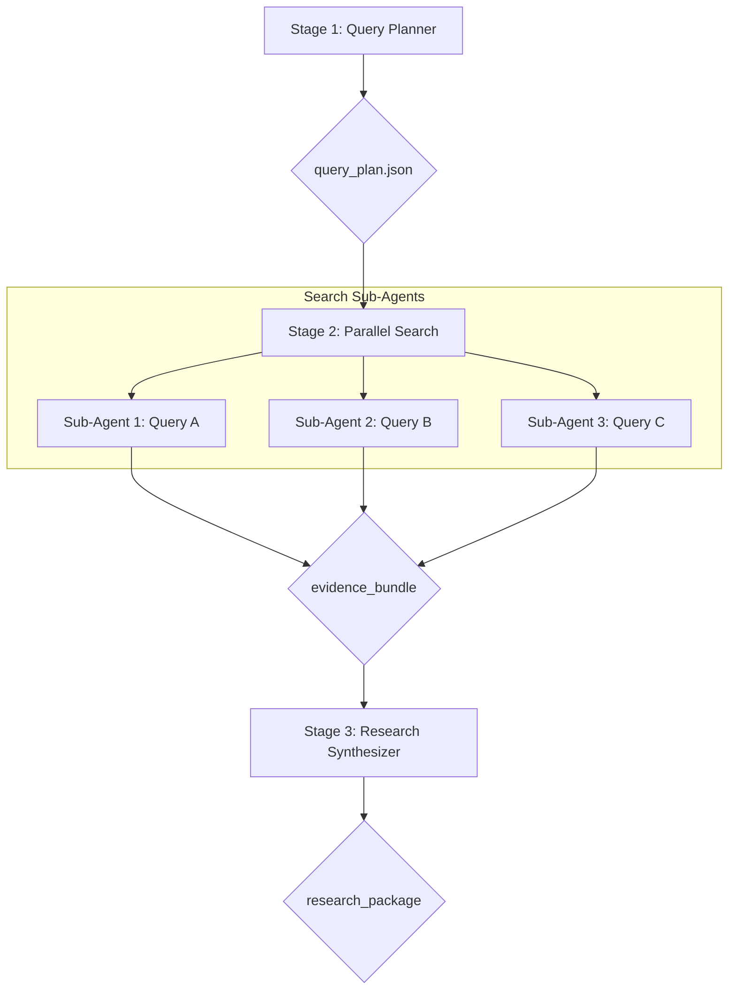

> 文档版本：v1.0  
> 负责人：Manus AI  
> 最后更新：2026-02-06  
> 状态：draft

# 2. 研究 Agent 工作流 (Stages 1-3)

研究工作流是 AutoPPT Agent 的信息输入源头，其核心目标是围绕用户给定的主题，进行高效、广泛且可靠的信息收集与整合。这个工作流横跨流水线的前三个阶段（Stage 1, 2, 3），由 `Query Planner`、`Search Sub-Agents` 和 `Research Synthesizer` 三个核心 Agent 协同完成。

## 2.1 工作流图

## 2.2 阶段详解

### Stage 1: 检索规划 (Query Planning)

- **主导 Agent**: `Query Planner`
- **输入**: `task_profile.json` (包含核心主题)
- **处理流程**:
  1.  `Query Planner` 分析主题，并从多个维度进行发散性思考，例如：
      - **定义与背景**: “什么是 [主题]？”
      - **核心技术/原理**: “[主题] 是如何工作的？”
      - **市场现状与趋势**: “[主题] 的市场规模和未来趋势如何？”
      - **关键参与者**: “谁是 [主题] 领域的主要公司或人物？”
      - **机遇与挑战**: “[主题] 面临的机遇和挑战是什么？”
  2.  Agent 将这些维度转化为 3-5 个具体的、互补的搜索查询字符串。
  3.  将这些查询字符串封装成 `query_plan.json` 文件。
- **输出**: `query_plan.json`

### Stage 2: 并行搜索 (Parallel Search)

- **主导 Agent**: `Search Sub-Agents` (由总控器并行启动)
- **输入**: `query_plan.json`
- **处理流程**:
  1.  总控器根据 `query_plan.json` 中的查询列表，启动相应数量的并行子任务，每个任务由一个独立的 `Search Sub-Agent` 负责。
  2.  每个 `Search Sub-Agent` 调用外部搜索引擎（如 Tavily API），执行其被分配的查询。
  3.  Agent 获取搜索结果，并对每个结果进行初步处理：
      - 抓取页面内容（如果需要）。
      - 根据相关性、时效性、权威性进行初步评分。
      - 强制记录来源 URL、标题和抓取时间。
  4.  每个子 Agent 将其处理后的结果打包成一个 `SearchResultBundle` 对象。
- **输出**: `evidence_bundle` (多个 `SearchResultBundle` 文件的集合)

### Stage 3: 汇总与归档 (Synthesis & Archival)

- **主导 Agent**: `Research Synthesizer`
- **输入**: `evidence_bundle`
- **处理流程**:
  1.  `Research Synthesizer` 读取所有的 `SearchResultBundle` 文件。
  2.  **去重**: 根据 URL 对所有搜索结果进行去重，确保每个信息源只被处理一次。
  3.  **排序与筛选**: 根据综合评分 (`score_final`) 对所有结果进行排序，并筛选掉低质量或不相关的结果。
  4.  **信息提取与整合**: Agent 阅读排名前列的高质量结果的标题、摘要和正文，提取关键事实、数据和观点。
  5.  **生成摘要**: 将提取出的信息整合成一篇结构化的、逻辑清晰的研究摘要 (`research_summary.md`)。这份摘要将作为后续内容生成的核心依据。
  6.  **打包归档**: 将研究摘要和所有被引用的原始证据数据一起打包成 `research_package`。
- **输出**: `research_package`

通过这个三阶段的工作流，AutoPPT Agent 能够确保其生成的所有内容都建立在坚实、可追溯的外部信息基础之上，从根本上解决了 AI 的“信息幻觉”问题。
