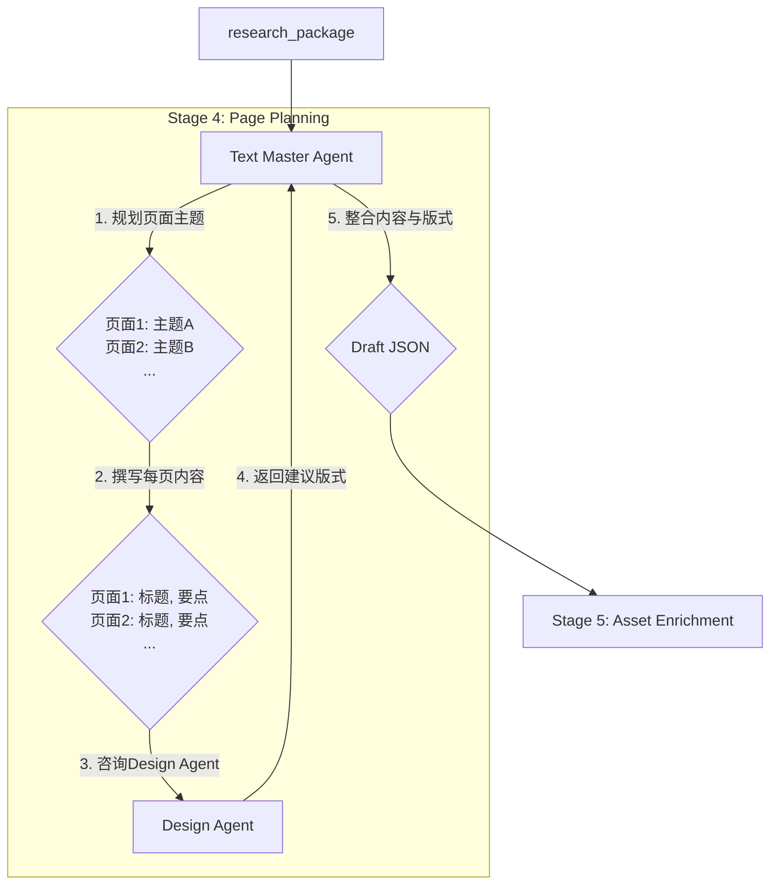

> 文档版本：v1.0  
> 负责人：Manus AI  
> 最后更新：2026-02-06  
> 状态：draft

# 3. 内容生成 Agent 工作流 (Stage 4)

内容生成工作流是连接“研究”与“设计”的关键桥梁。它负责将结构松散的研究摘要，转化为结构严谨的、逐页的演示文稿内容。这个工作流完全在流水线的 Stage 4 (页面规划) 中进行，由 `Text Master Agent` 和 `Design Agent` 以一种“专家咨询”的模式协同完成。

## 3.1 工作流图

## 3.2 阶段详解

### Stage 4: 页面规划 (Page Planning)

- **主导 Agent**: `Text Master Agent`
- **协作 Agent**: `Design Agent`
- **输入**: `research_package` (包含 `research_summary.md`)
- **处理流程**:

  1.  **大纲规划 (Outline Planning)**
      - `Text Master Agent` 首先通读 `research_summary.md`，理解其整体逻辑结构。
      - 它将摘要内容分解为一系列逻辑独立的章节或主题，并决定每个主题大致需要多少个页面来呈现。这形成了一个初步的演示大纲。

  2.  **逐页内容生成 (Page-by-Page Content Generation)**
      - 接着，`Text Master Agent` 开始逐页工作。对于每一页，它会：
        - 从大纲中选取一个具体的主题。
        - 围绕该主题，从研究摘要中提取最相关的 2-5 个关键信息点。
        - 将这些信息点提炼、改写成简洁、有力的标题 (`title`) 和要点列表 (`bullet_points`)。

  3.  **设计咨询 (Design Consultation)**
      - 在为一页生成了文本内容后，`Text Master Agent` 会将这些内容（标题、要点、段落等）打包，并向 `Design Agent` 发起一次“咨询请求”。
      - 请求的核心问题是：“对于这样一份文本内容，最适合使用哪种 `layout_type` 来呈现？”

  4.  **版式选择 (Layout Selection)**
      - `Design Agent` 接收到咨询请求后，会根据内容的结构和语义进行分析：
        - 如果内容包含明确的时间序列，它会推荐 `timeline`。
        - 如果内容是两个方案的优劣对比，它会推荐 `comparison_table`。
        - 如果内容是介绍一个核心人物，它会推荐 `profile_card`。
        - 对于大多数通用的图文内容，它会推荐 `text_image_split`。
      - `Design Agent` 还会根据内容，生成一个用于图片搜索的建议查询词 (`image_search_query`)。
      - 最后，`Design Agent` 将推荐的 `layout_type` 和 `image_search_query` 返回给 `Text Master Agent`。

  5.  **数据整合 (Data Aggregation)**
      - `Text Master Agent` 收到 `Design Agent` 的回复后，将自己生成的文本内容与 `Design Agent` 推荐的版式信息整合在一起，形成一个完整的页面数据对象。
      - 它会重复步骤 2-5，直到处理完大纲中的所有主题。

- **输出**: `Draft JSON` (一个包含了所有页面数据对象的 `PresentationPackage` 文件，但其中的图片路径还是搜索查询词)

这个“内容先行，设计匹配”的工作流，确保了演示文稿的布局设计始终服务于内容的表达，实现了内容与形式的高度统一。
