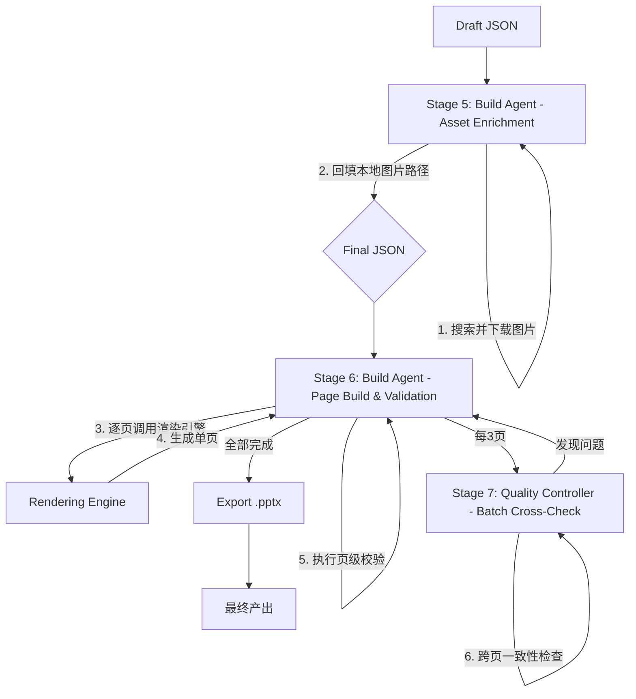

> 文档版本：v1.0  
> 负责人：Manus AI  
> 最后更新：2026-02-06  
> 状态：draft

# 4. 制作与校验 Agent 工作流 (Stages 5-7)

制作与校验工作流是 AutoPPT Agent 流水线的最后环节，负责将结构化的 `Final JSON` 数据转化为用户最终得到的、高质量的 `.pptx` 文件。这个工作流横跨流水线的最后三个阶段（Stage 5, 6, 7），主要由 `Build Agent` 和 `Quality Controller` 协同完成，并由 `Rendering Engine` 提供底层的渲染能力。

## 4.1 工作流图

## 4.2 阶段详解

### Stage 5: 素材填充 (Asset Enrichment)

- **主导 Agent**: `Build Agent`
- **输入**: `Draft JSON`
- **处理流程**:
  1.  `Build Agent` 遍历 `Draft JSON` 中的每一个页面对象。
  2.  如果页面对象中包含 `image_search_query` 字段，Agent 会调用外部图片搜索 API（如 Bing Image Search）执行该查询。
  3.  Agent 从搜索结果中选择一张最合适的图片，下载到本地的 `assets/` 目录。
  4.  对下载的图片进行预处理（例如，裁剪、压缩）。
  5.  将处理后的本地图片相对路径回填到页面对象的 `image_local_path` 字段中。
- **输出**: `Final JSON` (所有图片路径都已替换为本地路径)

### Stage 6: 制作与页级校验 (Build & Page Validation)

- **主导 Agent**: `Build Agent`
- **输入**: `Final JSON`, `template.pptx`
- **处理流程**:
  1.  `Build Agent` 开始逐页渲染。对于每一页，它会：
  2.  **调用渲染引擎**: 将该页的 JSON 数据对象和母版文件传递给 `Rendering Engine`。
  3.  `Rendering Engine` 根据 `layout_type` 选择正确的母版版式，并使用 `python-pptx` 库将 JSON 数据填充到对应的占位符中，生成一个内存中的页面对象。
  4.  **页级校验 (Page-Level Validation)**: 页面生成后，`Build Agent` 立即执行一系列自动校验，检查是否存在常见错误，例如：
      - **文本溢出**: 检查是否有文本超出了其文本框的边界。
      - **占位符缺失**: 检查 JSON 中指定的占位符是否存在于母版中。
      - **图片变形**: 检查图片是否被不当拉伸。
  5.  如果校验通过，则将该页标记为 `validated` 并继续下一页。如果失败，则记录错误并尝试自动修复（例如，通过缩小字号来解决文本溢出）。

### Stage 7: 批量校正与导出 (Batch Cross-Check & Export)

- **主导 Agent**: `Quality Controller`
- **输入**: 已通过页级校验的页面集合
- **处理流程**:
  1.  **触发时机**: 每当 `Build Agent` 完成 3 页的制作后，流程会暂停，并触发一次批量校正。
  2.  `Quality Controller` 会对这3个页面进行跨页一致性检查，例如：
      - **视觉一致性**: 检查字体、颜色、间距等设计元素是否在多页之间保持一致。
      - **逻辑连贯性**: 检查页面之间的内容是否存在逻辑矛盾或不连贯之处。
      - **术语统一性**: 检查关键术语的用法是否在全文中保持一致。
  3.  如果发现问题，`Quality Controller` 会向 `Build Agent` 或 `Text Master Agent` 发出修正指令。修正完成后，重新进行校验。
  4.  **最终导出**: 当所有页面都通过了页级校验和批量校正后，`Build Agent` 会将所有内存中的页面对象组合起来，最终导出一个完整的 `.pptx` 文件。

这个“制作-校验-校正”的闭环工作流，确保了 AutoPPT Agent 的最终产出不仅在数据层面是正确的，在视觉和逻辑层面也达到了专业水准。
