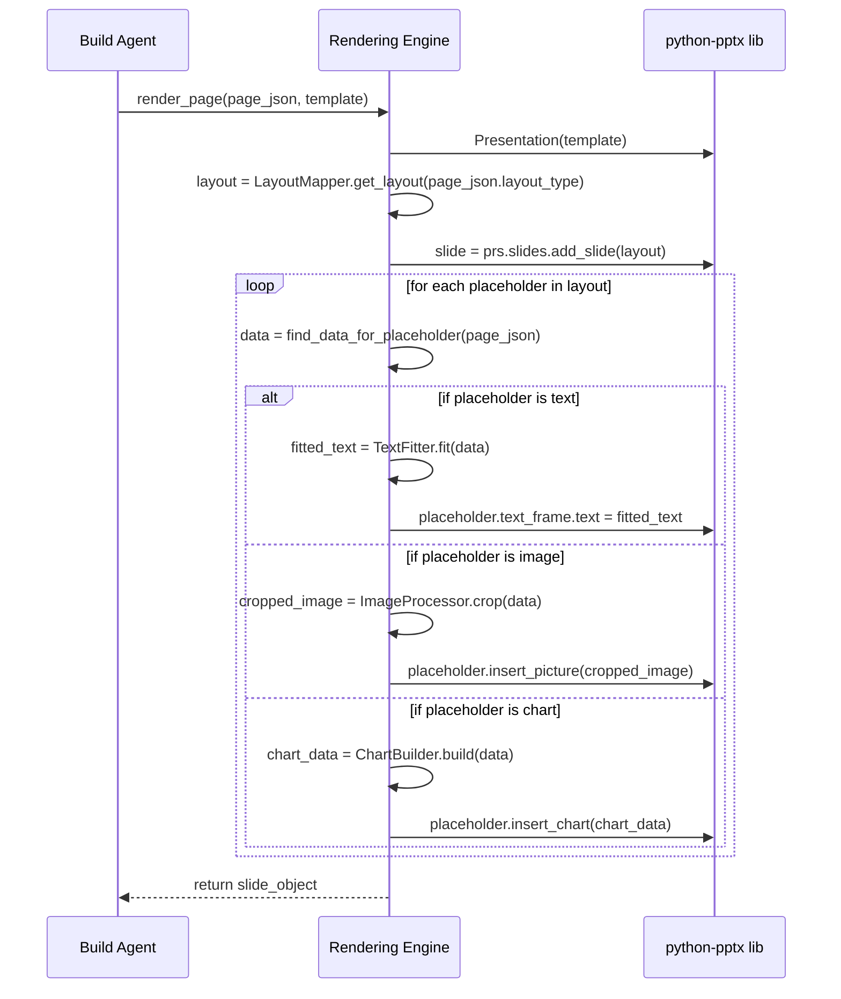

> 文档版本：v1.0  
> 负责人：Manus AI  
> 最后更新：2026-02-06  
> 状态：draft

# 1. 渲染引擎概述

渲染引擎（Rendering Engine）是 AutoPPT Agent 系统中负责将“蓝图”转化为“成品”的确定性核心模块。它扮演着一个精确的“工匠”角色，严格按照 Agent Core 生成的结构化 JSON 数据（`Final JSON`），使用 `python-pptx` 库来创建和操作原生的 PowerPoint 对象，最终生成一个完全可编辑的 `.pptx` 文件。

## 1.1 引擎定位与职责

- **确定性执行者**: 与充满不确定性的 Agent 不同，渲染引擎是一个纯粹的、确定性的执行者。给定相同的 `Final JSON` 和 `template.pptx`，它必须始终产生完全相同的输出。这种确定性使得引擎可以进行可靠的单元测试和回归测试。

- **内容与设计的分离**: 渲染引擎是实现“内容与设计分离”架构的关键。它不关心内容“为什么”是这样（这是 Agent 的工作），只关心“如何”将这些内容按照预设的规范精确地呈现在 PPT 页面上。

- **核心职责**: 
  1.  加载指定的 PPT 母版文件 (`template.pptx`)。
  2.  解析输入的 `Final JSON` 数据。
  3.  根据 `layout_type` 为每个页面选择正确的母版版式。
  4.  将 JSON 中的文本、图片、图表数据填充到版式对应的占位符中。
  5.  执行底层的样式设置，如字体、颜色、对齐方式等。
  6.  创建原生的图表对象。
  7.  最终将所有页面组合并保存为 `.pptx` 文件。

## 1.2 核心组件

渲染引擎内部由几个关键的辅助组件构成：

| 组件 | 职责 |
| :--- | :--- |
| **Layout Mapper** | 负责维护从逻辑 `layout_type` 到 `python-pptx` 中物理版式索引的映射关系。 |
| **Placeholder Filler** | 封装了向不同类型的占位符（文本、图片、图表）填充数据的核心逻辑。 |
| **Text Fitter** | 一个智能文本处理单元，负责在文本过长时自动调整字号或进行截断，防止内容溢出。 |
| **Image Processor** | 负责在插入图片前，根据占位符尺寸执行 `Crop-to-Fill` 算法，防止图片变形。 |
| **Chart Builder** | 负责根据 `chart_config` 数据，调用 `python-pptx` 的接口创建原生图表。 |

## 1.3 工作流程

通过这种模块化和确定性的设计，渲染引擎成为了整个 AutoPPT Agent 系统稳定、可靠的基石，确保了无论上游的 AI 如何发挥创造力，最终的产出始终符合专业的设计规范。
