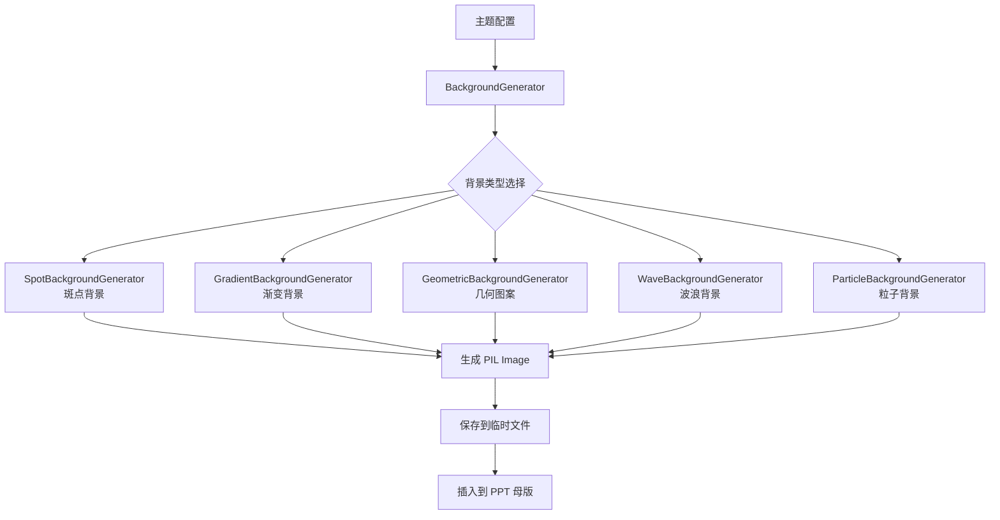

> 文档版本：v1.0  
> 负责人：Manus AI  
> 最后更新：2026-02-06  
> 状态：stable

# 背景生成系统架构

## 1. 系统目标

AutoPPT Agent 的背景生成系统旨在为演示文稿提供高质量、可定制、可编程生成的背景图片，替代传统的静态背景图片库。该系统具有以下核心优势：

- **可编程性**: 所有背景都通过 Python 代码生成，可以根据主题色、风格等参数动态调整。
- **一致性**: 确保整个演示文稿的视觉风格统一，所有背景都遵循相同的设计语言。
- **轻量化**: 无需存储大量背景图片文件，减少项目体积。
- **灵活性**: 可以快速创建新的背景风格，满足不同场景的需求。

## 2. 系统架构

## 3. 核心组件

### 3.1 `BackgroundGenerator` (基类)

这是所有背景生成器的抽象基类，定义了统一的接口和通用功能。

**核心方法**:
- `generate(width, height, theme_config) -> PIL.Image`: 生成指定尺寸和主题配置的背景图片。
- `save(image, output_path)`: 将生成的图片保存到指定路径。

### 3.2 具体生成器

每种背景风格都由一个独立的生成器类实现，继承自 `BackgroundGenerator`。

| 生成器类 | 风格描述 | 适用场景 |
| :--- | :--- | :--- |
| `SpotBackgroundGenerator` | 高级质感的斑点背景，类似水墨或喷溅效果 | 创意、艺术类演示 |
| `GradientBackgroundGenerator` | 平滑的渐变背景，支持线性和径向渐变 | 商务、通用场景 |
| `GeometricBackgroundGenerator` | 几何图案背景（三角形、圆形、多边形） | 科技、现代风格 |
| `WaveBackgroundGenerator` | 流动的波浪曲线背景 | 动态、流程类演示 |
| `ParticleBackgroundGenerator` | 粒子点阵背景 | 数据、科技类演示 |

### 3.3 `ThemeConfig` (配置对象)

一个 Pydantic 模型，用于封装背景生成所需的所有配置参数。

**核心字段**:
- `primary_color`: RGB 元组，主色调。
- `secondary_color`: RGB 元组，辅助色。
- `background_color`: RGB 元组，基础背景色。
- `opacity`: 浮点数 (0.0-1.0)，背景元素的透明度。
- `density`: 浮点数，背景元素的密度（如斑点数量）。

## 4. 技术栈

| 技术 | 用途 |
| :--- | :--- |
| **Pillow (PIL)** | 核心图像生成和处理库，用于创建画布、绘制基本形状和保存图片。 |
| **cairo (pycairo)** | 用于绘制高质量的矢量图形，特别是复杂的曲线和渐变。 |
| **NumPy** | 用于生成随机数据和进行数学计算（如粒子位置、波浪函数）。 |

## 5. 工作流程

1.  **接收配置**: 渲染引擎在初始化时，根据用户选择的主题或自动分析，创建一个 `ThemeConfig` 对象。
2.  **选择生成器**: 根据演示文稿的风格或用户偏好，选择一个具体的背景生成器。
3.  **生成背景**: 调用生成器的 `generate()` 方法，传入 PPT 页面的尺寸（如 1920x1080）和 `ThemeConfig`。
4.  **保存图片**: 将生成的 `PIL.Image` 对象保存为临时文件（如 `temp_background.png`）。
5.  **应用到母版**: 使用 `python-pptx` 的 API，将背景图片设置为母版的背景。

## 6. 扩展性设计

- **插件化**: 新的背景生成器可以作为独立的 Python 模块添加，无需修改核心代码。
- **参数化**: 所有生成器都通过 `ThemeConfig` 接收参数，便于统一管理和调整。
- **缓存机制**: 对于相同配置的背景，可以实现缓存，避免重复生成。
